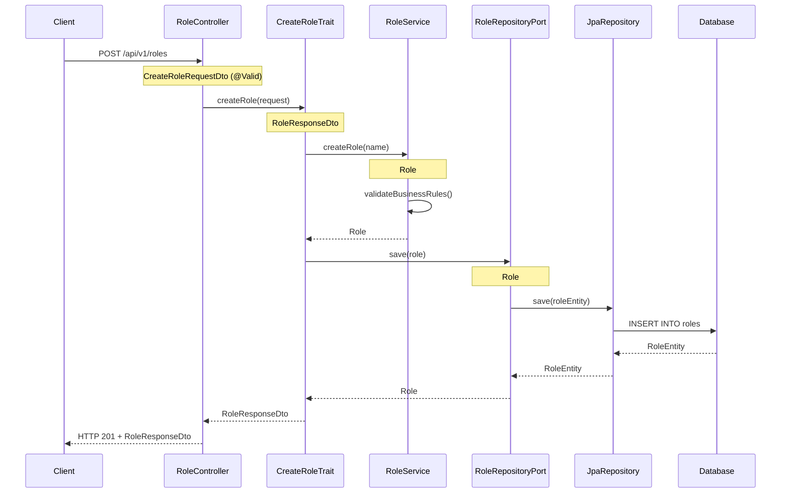

# Hex4j (hex4j) - Plantilla de Arquitectura Hexagonal Bloqueante

Una implementación completa de arquitectura hexagonal (patrón Ports and Adapters) utilizando Spring Boot MVC (Servlet + Undertow) para programación imperativa/bloqueante.

## Características

- **Programación Bloqueante**: Construido con Spring Boot MVC sobre Undertow; sin hilos virtuales, sin tipos reactivos
- **Arquitectura Hexagonal**: Separación clara de responsabilidades con capas de dominio, aplicación e infraestructura
- **Integración JPA**: Acceso a base de datos con Hibernate/JPA sobre H2 en memoria (JDBC)
- **Controladores REST**: Endpoints con `@RestController` en lugar de enrutamiento funcional
- **Testing Integral**: Tests unitarios con Mockito, controllers directos y slices `@DataJpaTest`
- **Integración MapStruct**: Mapeo automático entre DTOs y modelos de dominio
- **Manejo de Errores Centralizado**: `@ControllerAdvice` (`GlobalExceptionHandler`) con `ErrorResponse` estándar
- **Logging Bloqueante**: Filtro servlet (`LoggingFilter`) + aspecto (`LoggingAspect`) con MDC y `requestId`
- **GraphQL BFF**: Endpoint GraphQL como Backend For Frontend sobre XDB (/abc)
- **gRPC Client**: Adaptador cliente gRPC para consumir XDB vía protobuf (perfil `grpc`, puerto 9991, stub bloqueante)
- **Circuit Breaker**: resilience4j en adaptadores de infraestructura (AbcAdapter, LambdaAdapter, S3StoreAdapter; excluye SmtpEmailAdapter)
- **Scripts con acceso a infraestructura**: Scripts QuickJS (qjs4j, Java puro) pueden usar servicios XDB, Lambda, S3, Eventos, Email, Cache vía facade

## Requisitos Previos

- **Java 21** o superior
- **Gradle 8.7** o superior
- **Git** para clonar el repositorio

## Arquitectura Hexagonal Bloqueante

### Estructura de Paquetes

```
    __________________
  ./ co.onmind.hex /
  |
  |-- domain/                   # Capa de Dominio (Core Business Logic)
  |   |-- models/               # Entidades de dominio
  |   |-- services/             # Servicios de dominio bloqueantes
  |   `-- exceptions/           # Excepciones de dominio
  |-- application/              # Capa de Aplicacion (Use Cases)
  |   |-- dto/
  |   |   |-- in/               # DTOs de entrada
  |   |   `-- out/              # DTOs de salida
  |   |-- mappers/              # Mappers entre DTOs y modelos
  |   |-- usecases/             # Implementaciones de casos de uso bloqueantes
  |   `-- ports/
  |       |-- in/               # Puertos de entrada (Use Cases)
  |       `-- out/              # Puertos de salida (Repositories)
  |-- infrastructure/           # Capa de Infraestructura (Adapters)
  |   |-- configuration/        # Configuraciones de Spring MVC
  |   |-- controllers/          # Controladores REST (@RestController)
  |   |-- handlers/             # Resolver GraphQL (AbcGraphqlResolver)
  |   |-- lambda/               # Adaptador para invocacion de Lambda (LambdaAdapter)
  |   |-- events/               # Eventos (Kafka, RabbitMQ, SQS, SNS, EventBridge)
  |   |-- notification/         # Adaptador de email SMTP (SmtpEmailAdapter)
  |   |-- persistence/          # Implementaciones de persistencia JPA
  |   |   |-- adapters/         # Adaptadores de repositorio
  |   |   |-- entities/         # Entidades JPA
  |   |   |-- mappers/          # Mappers de entidades
  |   |   `-- repositories/     # Repositorios JPA
  |   |-- cache/                # Adaptadores de cache (Redis)
  |   |-- scripts/              # QuickJS + ClasspathScriptSourceAdapter + ScriptServicesFacade
  |   |-- storage/              # Adaptador de object storage (S3StoreAdapter)
  |   `-- webclients/           # Clientes HTTP bloqueantes para servicios externos
  |       |-- AbcAdapter          # Adaptador para XDB HTTP (implementa AbcPort)
  |       |-- GrpcAbcAdapter      # Adaptador para XDB gRPC (implementa AbcPort, perfil 'grpc')
  |       `-- CachedAbcAdapter    # Decorator: cachea responses de /abc via Redis
  `-- transverse/               # Componentes Transversales
      |-- exceptions/           # Manejo global de errores MVC (GlobalExceptionHandler)
      |-- logging/              # Filtro servlet + aspecto de logging
      `-- resilience/           # CircuitBreakerGeneric bloqueante
```

### Diagrama de Arquitectura

```mermaid
graph TB
    subgraph "Infrastructure Layer (Blocking)"
        CONTROLLER[RoleController<br/>@RestController]
        JPA[JPA Repository<br/>JpaRepository]
        CONFIG[MVC Configuration]
        WEBCLIENT[WebClient bloqueante<br/>External Services]
    end

    subgraph "Application Layer (Blocking)"
        UC[RoleUseCase<br/>Blocking Use Cases]
        PIN[Input Ports<br/>Direct Interfaces]
        POUT[Output Ports<br/>Direct Interfaces]
        DTO[DTOs<br/>Request/Response]
        MAP[Blocking Mappers<br/>MapStruct]
    end

    subgraph "Domain Layer (Pure Business Logic)"
        MODEL[Role Model<br/>Domain Entity]
        SERVICE[RoleService<br/>Blocking Domain Logic]
        EXCEPTIONS[Domain Exceptions<br/>Business Rules]
    end

    CONTROLLER --> PIN
    PIN --> UC
    UC --> SERVICE
    UC --> POUT
    POUT --> JPA
    SERVICE --> MODEL
    SERVICE --> EXCEPTIONS
    UC --> MAP
    MAP --> DTO
    CONFIG --> CONTROLLER
    WEBCLIENT --> UC

    classDef domain fill:#e1f5fe
    classDef application fill:#f3e5f5
    classDef infrastructure fill:#e8f5e8

    class MODEL,SERVICE,EXCEPTIONS domain
    class UC,PIN,POUT,DTO,MAP application
    class CONTROLLER,JPA,CONFIG,WEBCLIENT infrastructure
```

## Flujo Bloqueante Completo del Ejemplo Role

### 1. Flujo de Creación de Role



### 2. Características Bloqueantes Clave

- **Objetos directos**: Todos los métodos retornan tipos directos (`T`, `List<T>`, `void`, `Optional<T>`)
- **Hilos de plataforma**: Sin hilos virtuales; workers de Undertow en toda la aplicación
- **Transacciones**: Límites `@Transactional` en adaptadores de persistencia
- **Error Handling**: Excepciones de dominio propagadas a `@ControllerAdvice`
- **Validación**: Bean Validation con `@Valid` en controllers

### 3. Manejo de Errores (GlobalExceptionHandler centralizado)

Ubicado en `transverse/exceptions/GlobalExceptionHandler.java`, anotado con
`@RestControllerAdvice`. Convierte excepciones de dominio y validación en un
`ErrorResponse` estándar de 4 campos: `code`, `message`, `timestamp` y `path`.

Mapeo de excepciones a HTTP status:

| Excepción | HTTP Status | code |
|---|---|---|
| `DuplicateRoleException` | 409 CONFLICT | `CONFLICT` |
| `RoleNotFoundException` | 404 NOT_FOUND | `NOT_FOUND` |
| `ScriptNotAllowedException` | 403 FORBIDDEN | `SCRIPT_NOT_ALLOWED` |
| `MethodArgumentNotValidException` / `ConstraintViolationException` / `IllegalArgumentException` | 400 BAD_REQUEST | `VALIDATION_ERROR` |
| Cualquier otra | 500 INTERNAL_SERVER_ERROR | `INTERNAL_ERROR` |

Los controllers son deliberadamente delgados: delegan en los traits y dejan que
las excepciones suban al advice (no hay `try/catch` por controller).

## Inicio Rápido

### Instalación y Ejecución

1. **Clonar el repositorio**:
```bash
git clone https://github.com/kaesar/onmind-hex4j.git hex4j
cd hex4j
```

2. **Ejecutar la aplicación**:
```bash
./gradlew bootRun
```

La aplicación se iniciará en el puerto 8080 (datos iniciales: `ADMIN`, `USER`, `MODERATOR` vía `data.sql`).

3. **Verificar que la aplicación esté funcionando**:
```bash
curl http://localhost:8080/actuator/health
curl http://localhost:8080/api/health
```

> **Nota:** `/actuator/health` reporta `DOWN` si no hay Redis disponible
> (el `RedisHealthIndicator` exige conexión). Es el comportamiento esperado en
> local sin infraestructura; el endpoint propio `GET /api/health` siempre
> responde `UP`.

### Ejecutar Tests

```bash
# Ejecutar todos los tests (168 tests, sin brokers necesarios)
./gradlew test

# Ejecutar tests con reporte de cobertura
./gradlew test jacocoTestReport

# Ejecutar solo tests unitarios
./gradlew test --tests "*Test"

# Ejecutar solo tests de integración
./gradlew test --tests "*IntegrationTest"
```

## API Endpoints

### Endpoints Disponibles

| Método | Endpoint | Descripción | Request Body | Response |
|--------|----------|-------------|--------------|----------|
| `POST` | `/api/v1/roles` | Crear un nuevo role | `CreateRoleRequestDto` | `RoleResponseDto` |
| `GET`  | `/api/v1/roles` | Obtener todos los roles | - | `List<RoleResponseDto>` |
| `GET`  | `/api/v1/roles/{id}` | Obtener role por ID | - | `RoleResponseDto` |
| `PUT`  | `/api/v1/roles/{id}` | Actualizar role | `UpdateRoleRequestDto` | `RoleResponseDto` |
| `DELETE` | `/api/v1/roles/{id}` | Eliminar role | - | - |
| `GET`  | `/api/v1/roles/search?name={pattern}` | Buscar roles por patrón de nombre | - | `List<RoleResponseDto>` |
| `GET`  | `/api/v1/roles/count` | Contar roles | - | `{ "count": N }` |
| `POST` | `/api/v1/script/execute` | Ejecutar archivo `.js` whitelisteado (QuickJS) | `{ "script": "hello.js" }` | `ScriptResultResponseDto` |
| `GET` | `/api/v1/xdb/sheet` | Listar hojas XDB (prueba AbcWebClient) | - | `SheetResponseDto` |
| `GET`  | `/api/v1/store/items?bucket={name}` | Listar objetos de un bucket S3 | - | `List<StoreItemResponseDto>` |
| `POST` | `/api/v1/notifications/email` | Enviar email — habilitado con `app.notification.email.endpoint-enabled=true` | `SendEmailRequestDto` | `{ "message": ... }` |
| `GET` | `/api/health` | Health check propio | - | `{ "status": "UP", ... }` |
| `POST` | `/graphql` | Endpoint GraphQL (BFF sobre XDB) — habilitado con `app.graphql.enabled=true` | GraphQL query | GraphQL response |
| `gRPC` | `localhost:9991` | Cliente gRPC hacia XDB — habilitado con perfil `grpc` | `AbcRequest` proto | `AbcResponse` proto |

### Ejemplos de Uso

#### Crear un Role
```bash
curl -X POST http://localhost:8080/api/v1/roles \
  -H "Content-Type: application/json" \
  -d '{"name": "ADMIN"}'
```

**Respuesta**:
```json
{
  "id": 1,
  "name": "ADMIN",
  "createdAt": "2024-01-15T10:30:00"
}
```

#### Obtener todos los Roles
```bash
curl http://localhost:8080/api/v1/roles
```

**Respuesta**:
```json
[
  {
    "id": 1,
    "name": "ADMIN",
    "createdAt": "2024-01-15T10:30:00"
  },
  {
    "id": 2,
    "name": "USER",
    "createdAt": "2024-01-15T10:31:00"
  }
]
```

#### Obtener Role por ID
```bash
curl http://localhost:8080/api/v1/roles/1
```

#### Buscar Roles por Nombre
```bash
curl "http://localhost:8080/api/v1/roles/search?name=ADM"
```

#### Ejecutar Script JavaScript (archivo whitelisteado)

Ruta: `POST /api/v1/script/execute`
Body: `{ "script": "<nombre-archivo.js>" }` → `{ value, stdout, stderr }`

Solo se ejecutan archivos listados en `app.scripts.whitelist` (application.yml) y presentes en
`src/main/resources/scripts/` (config: `app.scripts.location`).

| Archivo |
|---------|
| `hello.js` |
| `example.js` |
| `services.js` |

```yaml
# application.yml
app:
  scripts:
    location: classpath:scripts/
    whitelist: hello.js,example.js,services.js
```

Para registrar un nuevo script: agregar el nombre a la lista `whitelist` (sin recompilar).
Para sobre-escribir en runtime: `--app.scripts.whitelist=hello.js,services.js`, o vía env var.

**Respuesta** (ejemplo):
```json
{
  "value": "Hello from hex4j scripts!",
  "stdout": "",
  "stderr": null
}
```

Flujo: nombre → `ScriptWhitelist` → carga classpath → `QuickJsAdapter` (sandbox).
Para ABCode: transpilar a `.js`, copiar a `scripts/` y agregar el nombre a la whitelist.
Nombre no permitido → `403 SCRIPT_NOT_ALLOWED`.

#### XDB - Sheet (XdbcUseCase + AbcWebClient)

Ruta: `GET /api/v1/xdb/sheet`

Endpoint de prueba que consume XDB vía `AbcWebClient.sheet()`. Devuelve el listado de hojas/colecciones.

```bash
curl http://localhost:8080/api/v1/xdb/sheet
```

**Respuesta** (ejemplo):
```json
{
  "ok": true,
  "status": 200,
  "message": "OK",
  "total": 5,
  "data": [
    { "kit01": "1", "kit02": "Hoja A", "kit03": "Title A" }
  ]
}
```

Flujo hexagonal: `XdbcController` → `XdbcSheetTrait` → `XdbcUseCase` → `AbcPort` (`CachedAbcAdapter` → `AbcAdapter` → `AbcWebClient`) → XDB.

**Configuración** (`application.yml`):
```yaml
app:
  xdb:
    base-url: http://localhost:9990
    auth-type: basic
    auth-token: admin:admin
    cache:
      enabled: true
      ttl-seconds: 300
```

**Operaciones del cliente `AbcWebClient`:**

| Método | Descripción | Parámetros clave |
|--------|-------------|------------------|
| `sheet(show, from, some)` | Listar hoja/colección | `show`, `from`, `some` |
| `find(request)` | Buscar registros | `from`, `some`, `where`, `show`, `sort`, `limit`, `offset` |
| `insert(request)` | Insertar registro | `from`, `some`, `puts` (datos) |
| `update(request)` | Actualizar registro | `from`, `some`, `puts`, `where` |
| `remove(request)` | Eliminar registro | `from`, `some`, `where` |
| `create(request)` | Crear colección | `from`, `some` |
| `drop(request)` | Borrar colección | `from`, `some` |
| `define(request)` | Definir esquema | `from`, `some`, `puts` (spec: `col=alias,...`) |
| `whoami()` | Identidad usuario | — |
| `signup(data)` | Registro usuario | `data` map |
| `ask(request)` | Genérico (rutea por `what`) | `what` + params |

**Respuesta estándar** (`AbcResponse`):
```json
{
  "ok": true,
  "status": 200,
  "message": "OK",
  "total": 10,
  "data": [...]
}
```

#### Listar Objetos de un Bucket S3
```bash
curl "http://localhost:8080/api/v1/store/items?bucket=my-bucket"
```

**Respuesta**:
```json
[
  {
    "key": "documents/report.pdf",
    "size": 102400,
    "lastModified": "2024-01-15T10:30:00",
    "eTag": "\"d41d8cd98f00b204e9800998ecf8427e\""
  }
]
```

### AWS EFS (Elastic File System)

EFS es un sistema de archivos NFS montado en el host/container. **No se necesita
un adapter AWS SDK para operaciones de archivo** (read/write/list) — funciona
con `ResourceLoader` de Spring siempre que EFS esté montado.

#### Configuración (EFS montado en /mnt/efs)

```yaml
app:
  scripts:
    location: file:/mnt/efs/scripts/  # ruta EFS montada
```

`ClasspathScriptSourceAdapter` resuelve la ubicación vía `ResourceLoader`, por lo
que `file:` funciona transparentemente (si el archivo no existe se lanza
`IllegalArgumentException`).

**Nota:** El AWS SDK (`software.amazon.awssdk.services.efs.EfsClient`) solo se
usa para operaciones de gestión (create/delete filesystem), no para I/O de
archivos.

## Configuración

### Dependencias Principales

El proyecto utiliza las siguientes dependencias clave:

```gradle
dependencies {
    // Spring Boot MVC + Undertow - Framework bloqueante principal
    implementation('org.springframework.boot:spring-boot-starter-web') {
        exclude group: 'org.springframework.boot', module: 'spring-boot-starter-tomcat'
    }
    implementation 'org.springframework.boot:spring-boot-starter-undertow'

    // Spring Data JPA - Acceso bloqueante a base de datos
    implementation 'org.springframework.boot:spring-boot-starter-data-jpa'

    // H2 - Base de datos en memoria
    runtimeOnly 'com.h2database:h2'

    // WebClient en modo bloqueante (.block()) para XDB y servicios externos
    implementation 'org.springframework.boot:spring-boot-starter-webflux'

    // Validation - Validación de datos
    implementation 'org.springframework.boot:spring-boot-starter-validation'

    // MapStruct - Mapeo de objetos
    implementation 'org.mapstruct:mapstruct:1.5.5.Final'
    annotationProcessor 'org.mapstruct:mapstruct-processor:1.5.5.Final'

    // QuickJS puro Java - Motor JavaScript sandboxed (reemplaza GraalJS)
    implementation 'com.caoccao.qjs4j:qjs4j:0.1.1'

    // Testing
    testImplementation 'org.springframework.boot:spring-boot-starter-test'
}
```

### Configuración de Base de Datos JPA

```yaml
spring:
  datasource:
    url: jdbc:h2:mem:hex4j;LOCK_TIMEOUT=10000;DB_CLOSE_ON_EXIT=FALSE
    driver-class-name: org.h2.Driver
    username: sa
    password: ''
  jpa:
    hibernate:
      ddl-auto: create-drop
    defer-datasource-initialization: true
  sql:
    init:
      mode: always
      data-locations: classpath:data.sql
  h2:
    console:
      enabled: true
      path: /h2-console
```

El esquema lo crea Hibernate (`create-drop`) y `data.sql` precarga
`ADMIN`, `USER` y `MODERATOR`. En perfil `test`, `sql.init.mode=never` para
tests herméticos.

### Configuración del Servidor

```yaml
server:
  port: 8080
```

Servidor Undertow (se excluye Tomcat del starter web).

### Configuración XDB (AbcWebClient)

```yaml
app:
  xdb:
    base-url: http://localhost:9990      # XDB server URL
    auth-type: basic                      # none | bearer | basic
    auth-token: admin:admin               # token o user:pass para basic
    cache:
      enabled: true
      ttl-seconds: 300
```

### Kafka (opcional, perfil `kafka`)

Habilita un consumidor bloqueante (`@KafkaListener`) que ejecuta scripts vía mensajes Kafka.

#### Activación

```bash
./gradlew bootRun --spring.profiles.active=dev,kafka
```

#### Configuración (`application-kafka.yml`)

```yaml
app:
  kafka:
    bootstrap-servers: localhost:9092
    topic:
      script-commands: hex4j.script.commands
      script-results: hex4j.script.results
```

#### Mensaje de comando (entrada, topic `hex4j.script.commands`)

```json
{
  "script": "hello.js",
  "correlationId": "req-123"
}
```

El consumidor (`KafkaEventConsumerAdapter`) ejecuta el script vía `ExecuteScriptTrait` y publica el resultado.

#### Mensaje de resultado (salida, topic `hex4j.script.results`)

Éxito:
```json
{
  "correlationId": "req-123",
  "result": { "value": "Hello from hex4j scripts!", "stdout": "", "stderr": null },
  "error": null
}
```

Error:
```json
{
  "correlationId": "req-123",
  "result": null,
  "error": "Script file not allowed: 'noexiste.js'. Allowed: hello.js, example.js"
}
```

#### Notas
- Kafka deshabilitado por defecto (no requiere broker). `application.yml` excluye `KafkaAutoConfiguration`.
- Perfil `kafka` lo rehabilita y activa `KafkaEventConsumerAdapter` + `KafkaEventPublisherAdapter`.
- Dependencia: `org.springframework.kafka:spring-kafka`.

### AWS SQS (opcional, perfil `sqs`)

Adaptadores bloqueantes para colas SQS usando `SqsClient` (sync) del AWS SDK v2.
Los beans de cliente viven en `AwsClientsConfiguration` (perfil `sqs`).

#### Activación

```bash
./gradlew bootRun --spring.profiles.active=dev,sqs
```

#### Configuración

```yaml
app:
  aws:
    region: us-east-1
    endpoint: http://localhost:4566   # LocalStack (opcional)
  sqs:
    queue-url: https://sqs.us-east-1.amazonaws.com/123/my-queue
    topic:
      script-results: https://sqs.us-east-1.amazonaws.com/123/results
```

- `SqsEventSenderAdapter` — publica eventos a SQS implementando `EventPublisherPort`. El `topic` se mapea a `queueUrl`; el `key` como atributo de mensaje.
- `SqsEventConsumerAdapter` — consume mensajes SQS: `pollMessages()` → deserializa `KafkaScriptCommand` → ejecuta script vía `ExecuteScriptTrait` → publica resultado vía `EventPublisherPort` → borra mensaje de la cola (`deleteMessage()`). En fallo de deserialización: borra el mensaje (poison cleanup). En fallo de ejecución: no borra (permite reprocessing). El polling es manual (no hay `@Scheduled`); se exponen `pollMessages()`, `processMessage()` y `deleteMessage()`.

### RabbitMQ (opcional, perfil `rabbitmq`)

Adaptadores para RabbitMQ usando Spring AMQP (`RabbitTemplate` + `@RabbitListener`). El patrón es idéntico al de Kafka.

#### Activación

```bash
./gradlew bootRun --spring.profiles.active=dev,rabbitmq
```

#### Configuración

```yaml
spring:
  rabbitmq:
    host: localhost
    port: 5672

app:
  rabbitmq:
    exchange:
      default: hex4j.script.commands
      results: hex4j.script.results
    queue:
      script-commands: hex4j.script.commands
```

- `RabbitMQEventPublisherAdapter` — publica eventos implementando `EventPublisherPort`. El `topic` se mapea a `exchange`; el `key` a `routingKey`.
- `RabbitMQEventConsumerAdapter` — consume mensajes via `@RabbitListener`, deserializa `KafkaScriptCommand`, ejecuta script vía `ExecuteScriptTrait`, publica resultado vía `EventPublisherPort`.

### AWS SNS (opcional, perfil `sns`)

Adaptador bloqueante para topics SNS usando `SnsClient` (sync, bean en `AwsClientsConfiguration`).

#### Activación

```bash
./gradlew bootRun --spring.profiles.active=dev,sns
```

#### Configuración

```yaml
app:
  sns:
    topic-arn: arn:aws:sns:us-east-1:123:my-topic
```

- `SnsEventSenderAdapter` — publica eventos a SNS implementando `EventPublisherPort`. El `topic` se mapea a `topicArn`.

### AWS EventBridge (opcional, perfil `eventbridge`)

Adaptador bloqueante para buses de eventos usando `EventBridgeClient` (sync, bean en `AwsClientsConfiguration`).

#### Activación

```bash
./gradlew bootRun --spring.profiles.active=dev,eventbridge
```

#### Configuración

```yaml
app:
  eventbridge:
    bus: default
```

- `EventBridgeEventSenderAdapter` — publica eventos vía `PutEventsRequest`. El `topic` se mapea a `eventBusName`. Campos: `detailType`="ScriptExecution", `source`="hex4j.application", `detail`=payload.

### gRPC (opcional, perfil `grpc`)

Adaptador cliente gRPC para consumir XDB vía protocol buffers en lugar de HTTP.
Paralelo al adaptador REST (`AbcWebClient`/`AbcAdapter`), implementa `AbcPort`
usando el stub **bloqueante** de gRPC.

#### Activación

```bash
./gradlew bootRun --spring.profiles.active=dev,grpc
```

#### Dependencias

```gradle
implementation 'io.grpc:grpc-netty-shaded:1.69.1'
implementation 'io.grpc:grpc-protobuf:1.69.1'
implementation 'io.grpc:grpc-stub:1.69.1'
implementation 'com.google.protobuf:protobuf-java:3.25.5'
implementation files('../api/xdb/build/libs/onmind-xdb-1.0.0-early2026.jar')
```

El JAR de xdb contiene las clases proto generadas (`AbcServiceGrpc`, `AbcRequest`, `AbcResponse`).

> **Nota de compilación condicional:** `GrpcAbcAdapter` y `GrpcConfiguration`
> solo se compilan cuando el JAR de xdb existe en esa ruta. Sin él, el build
> sigue en verde y el perfil `grpc` simplemente no está disponible.

#### Configuración

```yaml
app:
  xdb:
    grpc:
      host: localhost
      port: 9991
```

XDB abre el listener gRPC en el puerto 9991 (configurado en `api/xdb`).

#### Cómo funciona

1. `GrpcConfiguration` (perfil `grpc`) crea un `ManagedChannel` (Netty, plaintext)
   y el `AbcServiceBlockingStub`.
2. `GrpcAbcAdapter` implementa `AbcPort`:
   - `sheet(show, from, some)` → construye `AbcRequest` con `what=find`, llama
     gRPC `execute` (bloqueante), mapea `AbcResponse` proto → `AbcResponse` DTO.
   - `exec(request)` → mapea campos `AbcRequest` HTTP a proto `AbcRequest`,
     llama gRPC `execute`.
3. El bean `AbcPort @Primary` en `GrpcConfiguration` envuelve `GrpcAbcAdapter`
   con `CachedAbcAdapter` (cache de lecturas, igual que con el adaptador HTTP).
4. Circuit Breaker: `abc` (comparte configuración con `lambda`, `s3`).

#### Mapeo de campos

| HTTP AbcRequest | gRPC AbcRequest proto |
|---|---|
| way, what, from, some, with, show, call, puts | → mismo nombre en proto |
| where, sort, limit, offset | → codificados dentro de `puts` JSON |

Los campos `where`, `sort`, `limit`, `offset` no existen en el proto gRPC —
se combinan con `puts` como un JSON unificado (ej. `{"where":{...}, "limit":10, ...}`).

#### Adaptador gRPC sobre EFS (opcional)

EFS (Elastic File System) es un sistema de archivos NFS montado en el host.
No se necesita un adapter AWS SDK para operaciones de archivo — funciona con
`ResourceLoader` de Spring. Si EFS está montado (ej. en `/mnt/efs/scripts/`):

```yaml
app:
  scripts:
    location: file:/mnt/efs/scripts/
```

### Redis Cache (opcional)

Se incluye un adaptador bloqueante de cache basado en Redis que cachea respuestas
de lectura del endpoint `/abc` (XDB). El paquete `infrastructure/cache/`
contiene `RedisCacheAdapter` (implementa `CachePort`), y el decorator
`CachedAbcAdapter` en `infrastructure/webclients/` envuelve a `AbcAdapter`
para interceptar `sheet()` (caché) y pasar `exec()` (escrituras) sin caché.

#### Dependencia

```gradle
implementation 'org.springframework.boot:spring-boot-starter-data-redis'
```

#### Configuración (`application.yml`)

```yaml
spring:
  data:
    redis:
      host: localhost
      port: 6379
      timeout: 2000ms

app:
  xdb:
    cache:
      enabled: true          # activa/desactiva el decorator
      ttl-seconds: 300       # vida útil de las entradas cacheadas
```

#### Cómo funciona

1. `XdbcUseCase` inyecta `AbcPort` (no `AbcWebClient` directamente).
2. En `WebClientConfiguration`, el bean `AbcPort` primario (`@Primary`) es un
   `CachedAbcAdapter` que delega a `AbcAdapter`.
3. En `sheet(show, from, some)`:
   - Se genera la key `abc:sheet:{show}:{from}:{some}`.
   - **Cache HIT**: devuelve la respuesta deserializada desde Redis, sin tocar
     el delegate.
   - **Cache MISS**: llama al delegate (`AbcWebClient` → `/abc`), serializa el
     `AbcResponse` a JSON, lo almacena en Redis con el TTL configurado y lo
     devuelve.
4. En `exec(request)`: siempre delega sin caché (operaciones de escritura).
5. Cualquier error de Redis (lectura o escritura) se absorbe silenciosamente
   y se continúa con el delegate, por lo que un broker caído no rompe el flujo.

#### Componentes

| Clase | Paquete | Rol |
|---|---|---|
| `CachePort` | `application/ports/out/` | Puerto de sal genérico (get/set/evict) |
| `RedisCacheAdapter` | `infrastructure/cache/` | Adaptador concreto usando `StringRedisTemplate` (auto-configurado por Spring Boot) |
| `CachedAbcAdapter` | `infrastructure/webclients/` | Decorator de `AbcPort` que cachea `sheet()` |
| — | `infrastructure/configuration/` | Spring Boot auto-configura `StringRedisTemplate` |

#### Reutilizar el cache desde otro caso de uso

`CachePort` es genérico: cualquier caso de uso puede inyectarlo directamente
sin crear un nuevo adaptador Redis. Si solo necesitas cachear un puerto,
crea un decorator como `CachedAbcAdapter`.

```java
// Directo: uso genérico de CachePort
@Component
public class SomeUseCase {
    private final CachePort cachePort;

    public Result getData(String id) {
        String cached = cachePort.get("prefix:" + id);
        if (cached != null && !cached.isBlank()) {
            return fromJson(cached);
        }
        Result result = fetchFromDb(id);
        try {
            cachePort.set("prefix:" + id, toJson(result), Duration.ofSeconds(60));
        } catch (Exception e) {
            // degradar sin caché
        }
        return result;
    }
}
```

## Testing

### Estrategia de Testing

La aplicación implementa una pirámide de testing bloqueante (168 tests, sin brokers necesarios):

1. **Tests Unitarios (70%)**
   - Servicios de dominio con JUnit + AssertJ
   - Casos de uso con Mockito
   - Mappers y validaciones

2. **Tests de Slices (20%)**
   - Controllers directos con mocks
   - Repositorios JPA con `@DataJpaTest`

3. **Tests de Integración (10%)**
   - `@SpringBootTest` (Mailpit con `assumeTrue`: se salta si no hay SMTP en `localhost:1025`)
   - Flujos completos de API

### Ejemplo de Test Unitario

```java
@ExtendWith(MockitoExtension.class)
class RoleServiceTest {

    private RoleService roleService = new RoleService();

    @Test
    void shouldCreateRole() {
        // Given
        String roleName = "ADMIN";

        // When
        Role result = roleService.createRole(roleName);

        // Then
        assertEquals("ADMIN", result.getName());
        assertNotNull(result.getCreatedAt());
    }
}
```

### Test de Controller

```java
@ExtendWith(MockitoExtension.class)
class RoleControllerTest {

    @Mock
    private CreateRoleTrait createRoleTrait;
    @Mock
    private GetRoleTrait getRoleTrait;
    @Mock
    private RoleUseCase roleUseCase;

    private RoleController roleController;

    @BeforeEach
    void setUp() {
        // Construcción explícita: el mock de RoleUseCase también implementa
        // los traits, por lo que @InjectMocks sería ambiguo.
        roleController = new RoleController(createRoleTrait, getRoleTrait, roleUseCase);
    }

    @Test
    void shouldCreateRoleViaController() {
        // Given
        CreateRoleRequestDto request = new CreateRoleRequestDto("ADMIN");
        when(createRoleTrait.createRole(any())).thenReturn(new RoleResponseDto(1L, "ADMIN", LocalDateTime.now()));

        // When
        ResponseEntity<RoleResponseDto> result = roleController.createRole(request);

        // Then
        assertEquals(HttpStatus.CREATED, result.getStatusCode());
        assertEquals("ADMIN", result.getBody().name());
    }
}
```

## Desarrollo y Extensión

### Diferencias Clave con hex4w (WebFlux)

| Aspecto | hex4j (Spring MVC) | hex4w (WebFlux) |
|---------|-------------------|-------------------------|
| **Framework** | Spring MVC | Spring WebFlux |
| **Modelo de Programación** | Imperativo/Bloqueante | Reactivo/No-bloqueante |
| **Controladores** | `@RestController` | `RouterFunction` + `Handler` |
| **Persistencia** | JPA/Hibernate | R2DBC |
| **Tipos de Retorno** | Objetos directos | `Mono<T>` / `Flux<T>` |
| **Testing** | JUnit + Mockito | WebTestClient + StepVerifier |
| **Base de Datos** | H2 con JDBC | H2 con R2DBC |
| **Motor JS** | QuickJS (qjs4j, Java puro) | GraalJS |

### Cómo Extender la Plantilla con Nuevas Entidades

#### 1. Crear el Modelo de Dominio

```java
// domain/models/User.java
public class User {
    private Long id;
    private String username;
    private String email;
    private LocalDateTime createdAt;

    // Constructor, getters, setters, business logic
}
```

#### 2. Crear el Servicio de Dominio Bloqueante

```java
// domain/services/UserService.java
@Component
public class UserService {

    public User createUser(String username, String email) {
        // Validaciones de negocio
        validateUsername(username);
        validateEmail(email);
        User user = new User();
        user.setUsername(username);
        user.setEmail(email);
        user.setCreatedAt(LocalDateTime.now());
        return user;
    }

    public void validateBusinessRules(User user) {
        // Lógica de validación
    }
}
```

#### 3. Definir DTOs

```java
// application/dto/in/CreateUserRequestDto.java
public record CreateUserRequestDto(
    @NotBlank String username,
    @Email String email
) {}

// application/dto/out/UserResponseDto.java
public record UserResponseDto(
    Long id,
    String username,
    String email,
    LocalDateTime createdAt
) {}
```

#### 4. Crear Puertos Bloqueantes

```java
// application/ports/in/CreateUserTrait.java
public interface CreateUserTrait {
    UserResponseDto createUser(CreateUserRequestDto request);
}

// application/ports/out/UserRepositoryPort.java
public interface UserRepositoryPort {
    User save(User user);
    Optional<User> findById(Long id);
    List<User> findAll();
    boolean existsByUsername(String username);
}
```

#### 5. Caso de Uso por Implementar

```java
// application/usecases/UserUseCase.java
@Service
public class UserUseCase implements CreateUserTrait, GetUserTrait {

    private final UserService userService;
    private final UserRepositoryPort userRepository;
    private final UserMapper userMapper;

    @Override
    public UserResponseDto createUser(CreateUserRequestDto request) {
        User user = userMapper.toEntity(request);
        user = userService.createUser(user.getUsername(), user.getEmail());
        userService.validateBusinessRules(user);
        user = userRepository.save(user);
        return userMapper.toResponseDto(user);
    }
}
```

#### 6. Crear Entidad JPA y Repositorio

```java
// infrastructure/persistence/entities/UserEntity.java
@Entity
@Table(name = "users")
public class UserEntity {
    @Id
    @GeneratedValue(strategy = GenerationType.IDENTITY)
    private Long id;

    @Column(nullable = false, unique = true)
    private String username;

    @Column(nullable = false)
    private String email;

    @Column(name = "created_at")
    private LocalDateTime createdAt;
}

// infrastructure/persistence/repositories/JpaUserRepository.java
public interface JpaUserRepository extends JpaRepository<UserEntity, Long> {
    boolean existsByUsername(String username);
    Optional<UserEntity> findByEmail(String email);
}
```

#### 7. Implementar Adaptador de Persistencia

```java
// infrastructure/persistence/adapters/UserRepositoryAdapter.java
@Repository
@Transactional
public class UserRepositoryAdapter implements UserRepositoryPort {

    private final JpaUserRepository jpaRepository;
    private final UserEntityMapper entityMapper;

    @Override
    public User save(User user) {
        UserEntity entity = user.getId() == null
            ? entityMapper.toNewEntity(user)
            : entityMapper.toEntity(user);
        return entityMapper.toDomain(jpaRepository.save(entity));
    }
}
```

#### 8. Crear Controlador REST

```java
// infrastructure/controllers/UserController.java
@RestController
@RequestMapping("/api/v1/users")
public class UserController {

    private final CreateUserTrait createUserTrait;
    private final GetUserTrait getUserTrait;

    @PostMapping
    public ResponseEntity<UserResponseDto> createUser(@Valid @RequestBody CreateUserRequestDto request) {
        UserResponseDto response = createUserTrait.createUser(request);
        return ResponseEntity.status(HttpStatus.CREATED).body(response);
    }
}
```

### Mejores Prácticas para Desarrollo Bloqueante

1. **Sin tipos reactivos**: Nunca usar `Mono`/`Flux`; retornar `T`, `List<T>`, `Optional<T>` o `void`
2. **Transacciones**: Anotar adaptadores de persistencia con `@Transactional` (lecturas `readOnly = true`)
3. **Manejo de Errores**: Lanzar excepciones de dominio y dejar que `@ControllerAdvice` las mapee
4. **Validación**: Usar `@Valid` en controllers + Bean Validation en DTOs
5. **Testing**: Mocks por puerto; `@DataJpaTest` para persistencia
6. **Inyección**: Constructor injection explícito (cuidado con `@InjectMocks` ambiguo si un mock implementa varios traits)

## Resilience (Circuit Breaker)

Adaptadores de infraestructura que llaman servicios externos están protegidos con
**Circuit Breaker** vía Resilience4j. La clase `CircuitBreakerGeneric` en
`transverse/resilience/` envuelve llamadas bloqueantes con `executeSupplier` / `executeRunnable`.

### Dependencia

```gradle
implementation 'io.github.resilience4j:resilience4j-circuitbreaker:2.2.0'
```

### Configuración de Circuit Breakers

Los beans se definen en `WebClientConfiguration` con la misma configuración base:

| Bean | Servicio protegido |
|---|---|
| `abcCircuitBreaker` | XDB `/abc` (HTTP) |
| `lambdaCircuitBreaker` | AWS Lambda invocation |
| `s3CircuitBreaker` | AWS S3 operations |

Config: failure-rate 50%, window 10, min 5 calls, 30s open, 3 half-open calls.

### Adaptadores con Circuit Breaker

| Adaptador | Bean inyectado |
|---|---|
| `AbcAdapter` | `abcCircuitBreaker` |
| `LambdaAdapter` | `lambdaCircuitBreaker` |
| `S3StoreAdapter` | `s3CircuitBreaker` |

### Adaptadores SIN Circuit Breaker

| Adaptador | Razón |
|---|---|
| `SmtpEmailAdapter` | Email es best-effort; SMTP lento pero funcional no debe bloquear entrega. Retry es preferible a fast-fail. |

## Notificaciones (Email)

### Arquitectura

`EmailPort` (puerto de salida) + `SmtpEmailAdapter` (adaptador concreto) en
`infrastructure/notification/`. El adaptador está registrado como `@Component`
y usa `JavaMailSender` de Spring Boot (auto-configurado vía `spring.mail.*`).

El envío es bloqueante directo (sin wrappers): `JavaMailSender.send()` con
`SimpleMailMessage`. Compatible con cualquier servidor SMTP, incluyendo
[Mailpit](https://mailpit.axllent.org/) para testing.

### Configuración

```yaml
spring:
  mail:
    host: localhost
    port: 1025
    username: ""   # sin autenticación para Mailpit local
    password: ""

app:
  notification:
    email:
      from: hex4j@localhost
      endpoint-enabled: false   # true para habilitar el endpoint POST /api/v1/notifications/email
```

### Endpoint de Envio de Email

El endpoint está **deshabilitado por defecto**. Para habilitarlo:

```yaml
app:
  notification:
    email:
      endpoint-enabled: true
```

O al lanzar la aplicación: `./gradlew bootRun --args='--app.notification.email.endpoint-enabled=true'`

**Endpoint:**
```
POST /api/v1/notifications/email
Content-Type: application/json
```

**Body:**
```json
{
  "to": "user@example.com",
  "subject": "Hello",
  "from": "hex4j@localhost",
  "cc": ["admin@example.com"],
  "body": "Mensaje de prueba"
}
```

`from` y `cc` son opcionales. Si `from` no se envía, se usa el valor de `app.notification.email.from`.

**Respuesta exitosa (200):**
```json
{"message": "Email queued successfully"}
```

### Testing con Mailpit

Mailpit simula un servidor SMTP y expone una API HTTP para inspeccionar emails.

```bash
# Iniciar Mailpit
docker run -d -p 1025:1025 -p 8025:8025 mailpit/mailpit

# Ver emails enviados
curl http://localhost:8025/api/v1/messages
```

El test de integración (`SmtpEmailAdapterIntegrationTest`) intenta conectar a
`localhost:1025` (SMTP). El test se salta automáticamente si no hay nada
escuchando en ese puerto.

## Monitoreo y Observabilidad

### Endpoints de Actuator

La aplicación incluye endpoints de monitoreo:

- `/actuator/health` - Estado de salud de la aplicación (requiere Redis para `UP`)
- `/actuator/info` - Información de la aplicación
- `/actuator/metrics` - Métricas de la aplicación
- `/api/health` - Health check propio (siempre `UP`)

### Logging Bloqueante

El proyecto incluye logging bloqueante configurado:

```yaml
logging:
  level:
    co.onmind.hex: DEBUG
    org.hibernate.SQL: DEBUG
```

- `LoggingFilter` (servlet, `@Order(1)`): genera `requestId` (8 chars), mide
  duración, publica MDC (`requestId`, `method`, `path`, `status`, `duration`),
  avisa requests lentos (>1000ms) y limpia el MDC al final.
- `LoggingAspect`: entry/exit de capas application/domain/controllers con
  argumentos, resultado y tiempo; avisa ejecuciones lentas (>500ms).
- `LoggingConfiguration`: `CommonsRequestLoggingFilter` con query string y
  payload (máx 10000 chars).

## GraphQL (BFF sobre XDB ABC)

hex4j expone un endpoint GraphQL que actúa como **Backend For Frontend** sobre la API
`/abc` de xdb. El resolver (`AbcGraphqlResolver`) consume `AbcSheetUseCase` →
`AbcPort` (`@Primary` CachedAbcAdapter) → `AbcAdapter` → `POST /abc` (todo bloqueante).

### Configuración

Deshabilitado por defecto. Para habilitar:

```yaml
app:
  graphql:
    enabled: true
```

O al lanzar:
```bash
./gradlew bootRun --args='--app.graphql.enabled=true'
```

El endpoint está en `/graphql`. En modo dev, GraphiQL está en `/graphiql`.

### Queries disponibles

```graphql
# 1. Consulta un sheet individual (equivalente a /api/v1/xdb/sheet)
query {
  abcSheet(show: "orders", from: "customers", some: "id,name") {
    ok status message total data
  }
}

# 2. Consulta múltiples sheets en un solo request (combina conjuntos)
query {
  abcSheets(requests: [
    { show: "orders", from: "customers", some: "id,name" }
    { show: "products", from: "inventory", some: "sku,qty" }
  ]) {
    ok status message total data
  }
}
```

El query `abcSheets` itera los requests en secuencia y retorna todas las respuestas
combinadas. El cache de Redis (`CachedAbcAdapter`) aplica a cada sheet individual.

## AWS Lambda (opcional)

Adaptador bloqueante para invocación directa de funciones Lambda (sin API Gateway)
usando `LambdaClient` (sync) del AWS SDK v2. El adapter implementa `LambdaPort`
(output port genérico).

### Configuración

```yaml
app:
  lambda:
    region: us-east-1
    endpoint: http://localhost:4566  # LocalStack (opcional)
```

### Uso

```java
@Component
public class MyUseCase {
    private final LambdaPort lambdaPort;

    public String process(String input) {
        return lambdaPort.invoke("my-function", "{\"input\":\"" + input + "\"}");
    }
}
```

`LambdaPort.invoke(functionName, payload)` retorna `String` con el
response payload de la Lambda. Si Lambda devuelve `functionError`, se lanza
`RuntimeException`. `invokeAsync` usa `InvocationType.EVENT` (fire-and-forget).
El `LambdaClient` se configura como un `@Bean` en
`WebClientConfiguration` (region + endpointOverride configurable).

## Scripts con Acceso a Infraestructura (QuickJS)

Los scripts JavaScript (QuickJS puro Java vía [qjs4j](https://github.com/caoccao/qjs4j))
pueden interactuar con la infraestructura disponible a través del facade
`ScriptServicesPort`, expuesto como el objeto global `services` dentro del
contexto de ejecución. Cada ejecución crea un `JSRuntime` + `JSContext` nuevos.

### Dependencia

```gradle
implementation 'com.caoccao.qjs4j:qjs4j:0.1.1'
```

Motor 100% Java, cero dependencias nativas: funciona en Linux, macOS, Windows
y contenedores musl/Alpine. Apunta a ES2024 con conformidad medida (Test262).

### Seguridad

A diferencia de GraalJS, aquí no hay `HostAccess` que configurar: el script solo
ve los globales que el adapter enlaza explícitamente (`services` y `console`).
No hay I/O, ni red, ni reflexión, ni acceso a clases Java salvo los métodos
del facade. Capas adicionales:

| Medida | Valor |
|---|---|
| Whitelist | `app.scripts.whitelist` + `ScriptWhitelist.requireAllowed()` (403 si no permitido) |
| Anti-traversal | `ClasspathScriptSourceAdapter` rechaza `..`, `/`, `\` |
| Memoria | `setMaxMemoryUsage(32MB)` (cubre ArrayBuffers; resto acotado por `-Xmx`) |
| Límite de tiempo | No disponible en qjs4j 0.1.1 (solo existe en `main` sin publicar) |

Los scripts **solo pueden** usar los métodos públicos del facade.

> **Nota:** `console.log/info/debug/warn/error` está enlazado por el adapter y
> su salida se captura en el campo `stdout` del resultado (no va a la consola
> del servidor salvo en nivel `DEBUG`).

### API `services.*`

| Método | Descripción | Puerto subyacente |
|---|---|---|
| `abcSheet(show, from, some)` | Query XDB /abc (read) | `AbcPort.sheet()` |
| `abcExec(what, from, some, with, puts)` | XDB /abc (write/exec) | `AbcPort.exec()` |
| `publish(topic, key, payload)` | Publicar evento | `EventPublisherPort` (Kafka/SQS/SNS/EventBridge/RabbitMQ) |
| `invoke(functionName, payload)` | Invocar Lambda (síncrono, espera respuesta) | `LambdaPort.invoke()` |
| `invokeAsync(functionName, payload)` | Invocar Lambda (fire-and-forget, `InvocationType.EVENT`) | `LambdaPort.invokeAsync()` |
| `listItems(bucket)` | Listar objetos S3 | `StorePort` |
| `sendEmail(to, subject, body)` | Enviar email | `EmailPort` |
| `cacheGet(key)` | Leer cache Redis | `CachePort` |
| `cacheSet(key, value)` | Escribir cache (TTL 5 min) | `CachePort` |
| `cacheEvict(key)` | Borrar cache | `CachePort` |

Los métodos son llamadas directas bloqueantes al facade. Los valores de retorno
llegan al script como objetos JS (los records se convierten a `Map`); los
números enteros se renderizan sin `.0` en el `value` del resultado.

### Ejemplo

```javascript
// Read from XDB
const sheet = services.abcSheet("id,name", "xykit", "sheet");
console.log("Sheet:", JSON.stringify(sheet));

// Publish an event
services.publish("script.results", "script-1", JSON.stringify({ ok: true }));

// Invoke Lambda
const result = services.invoke("my-function", JSON.stringify({ action: "ping" }));

// Cache
services.cacheSet("last-run", "2026-08-01");
const cached = services.cacheGet("last-run");
```

Ejecutarlo:

```bash
curl -X POST http://localhost:8080/api/v1/script/execute \
  -H "Content-Type: application/json" \
  -d '{"script":"services.js"}'
```

### Transporte XDB (HTTP vs gRPC)

  El facade inyecta `AbcPort`, que Spring resuelve según perfil:

| Perfil | Transporte | Bean `@Primary` |
|---|---|---|
| Default | HTTP/WebClient | `AbcAdapter` |
| `grpc` | gRPC bloqueante (puerto 9991) | `GrpcAbcAdapter` |

```bash
# HTTP (default)
./gradlew bootRun --spring.profiles.active=dev

# gRPC
./gradlew bootRun --spring.profiles.active=dev,grpc
```

El script usa `services.abcSheet(...)` sin cambios — el transporte es transparente.

### Invoke Lambda: síncrono vs fire-and-forget

| Método | InvocationType | Comportamiento |
|---|---|---|
| `services.invoke(fn, payload)` | `REQUEST_RESPONSE` (default) | Espera a que Lambda termine y devuelve el payload |
| `services.invokeAsync(fn, payload)` | `EVENT` | AWS encola el evento y devuelve inmediatamente (202 Accepted) |

El script usa `services.abcSheet(...)` sin cambios — el transporte es transparente.
